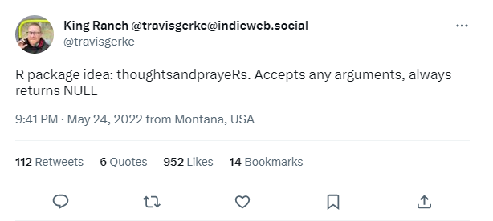

# thoughtsNprayers

`{thoughtsNprayers}` is an R package that simulates the realistic
effects of offering thoughts and prayers after a tragedy.

All credit to Travis Gerke and his
[tweet](https://twitter.com/travisgerke/status/1529276517452111872?cxt=HHwWgICjofy4irkqAAAA)



## installation

You can install this package via Github:

``` r
remotes::install_github("ekholme/thoughtsNprayers")
```

## usage

This package contains a single function, `thoughts_prayers()`. You can
pass any argument you want into this function.

``` r
library(thoughtsNprayers)

thoughts_prayers("we offer you our thoughts and prayers in this difficult time")
```

    ## NULL
